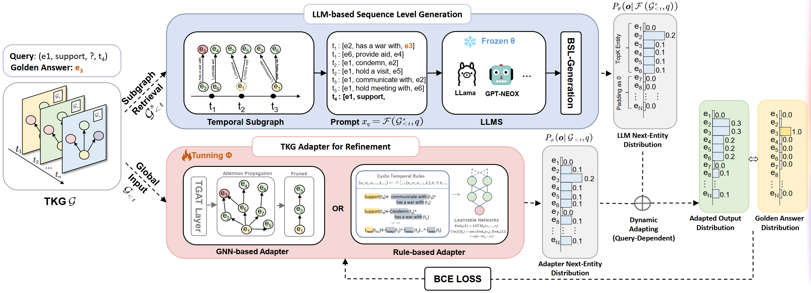

# Ignite Forecasting with SPARK: An Efficient Generative Framework for Refining LLMs in Temporal Knowledge Graph Forecasting

The official codes for paper "Ignite Forecasting with SPARK: An Efficient Generative Framework for Refining LLMs in Temporal Knowledge Graph Forecasting" [DASFAA'25].

## Overview of SPARK



* In the first stage, the LLM generates the next entity distribution based on retrieved historical sequences using BSL generation.
* Simultaneously, the adapting models operate on the global graph, learning temporal patterns and producing their own next entity distribution.
* We can see that candidate entities like "e7" and "e8," omitted by the LLM due to input length limitations, are considered by the TKG Adapter.
* In the next stage, these two distributions are dynamically combined, resulting in an adapted output distribution as the final prediction.

## Experimental Details

When implementing, we use the efficient LLM inference framework vLLM. All experiments were conducted on Nvidia A100 GPUs. For ICL-retrieval-based LLMs, we use a history length of 100; while for TLR-retrieval-based LLMs, we follow the same settings. For the beam-search strategy, we set the number of beams $n$ =10. To make the adapter training process more efficient, we precompute the LLMs' output distributions and store the results. Initial embeddings of entities and relations are generated using LLama2-7B, and projected to a fixed embedding size of 200 across all datasets.

## How to Run?

### Installing Dependencies

- Dependencies can be installed using `requirements.txt`.

### Preparation

- Make directories: `./model_checkpoints、./wandb`
- Download datasets from [here](https://figshare.com/s/b327c9e306e28b710c9b), put them in  `./data` directory.
  - `original` denotes the original datasets, `processed` includes contextual information using TLR (in [GenTKG](https://aclanthology.org/2024.findings-naacl.268.pdf)), `rule_output` includes rules extracted using TLR.
- **Optional:** Download LLM model `gpt-neox-20b`、`llama-2-7b-hf`、`internlm2-7b` from Hugging face.

### Run SPARK (eg. dataset: icews14)

- Step1: Precompute the LLMs' output distributions and store the results.

```shell
# With TLR
python main.py --DATASET "icews14" --MODEL_NAME your_LLM_path --RAG "TLR" --GEN_MODE "beam" --SAVE_LLM

# With ICL
python main.py --DATASET "icews14" --MODEL_NAME your_LLM_path --RAG "ICL" --GEN_MODE "beam" --SAVE_LLM
```

We also provide one of our precomputed results in `./data/llm_result.`

- Step2: Train SPARK(G) or SPARK(R) as adapters, and then evaluate on test dataset.

```shell
# SPARK(G)
python main.py --DATASET "icews14" --MODEL_NAME your_LLM_path --RAG "TLR" --GEN_MODE "beam" --LOAD_LLM --ADAPTER_NAME "xERTE" 

# SPARK(R)
python main.py --DATASET "icews14" --MODEL_NAME your_LLM_path --RAG "TLR" --GEN_MODE "beam" --LOAD_LLM --ADAPTER_NAME "TLogic"

```

### Reproduce Other Analysis

#### Cross-Domain Generalization

```
# Add Step3:
python main.py --DATASET "icews18" --MODEL_NAME your_LLM_path --RAG "TLR" --GEN_MODE "beam" --LOAD_LLM --ADAPTER_NAME "xERTE" --RESTORE your_checkpoint --max_attended_edges 60 --ratio_update 0.75 --ONLY_TEST
```

#### Ablation Study

* **w/o TKG Adapter:** only use Step1 (with TLR).
* **w/o BSL Generation:**

```
# Modify Step1 to the following command and keep step2 as original:
python main.py --DATASET "icews14" --MODEL_NAME your_LLM_path --RAG "TLR" --GEN_MODE "iterative" --SAVE_LLM
```

## Citations

If you find this work helpful, please kindly cite:

```
@inproceedings{SPARK,
  author       = {Yin, Gongzhu and Zhang, Hongli and others},
  title        = {Ignite Forecasting with SPARK : An Efficient
Generative Framework for Refining LLMs in
Temporal Knowledge Graph Forecastin},
  booktitle    = {DASFAA},
  year         = {2025}
}
```

For any further questions, feel free to contact: `yingz@hit.edu.cn`
